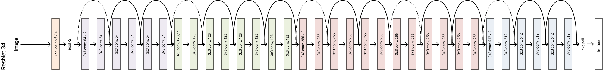

# ResNet Implementation in Pytorch

This is the implementation of the famous ResNet from Kaiming He et al. (Microsoft Research). It won the 1st place on the ILSVRC 2015 classification task.

The original paper can be read from [here ](https://arxiv.org/abs/1512.03385). Following is the visual represntation of the ResNet 34 model.

*Deeper neural networks are more difficult to train.* Why? One big problem of deeper network is the vanishing gradient. Basically, the model is not able to learn anymore.

To solve this problem, the Authors proposed to use a reference to the previous layer to compute the output at a given layer. In ResNet, the output form the previous layer, called **residual**, is added to the output of the current layer. The following picture visualizes this operation

